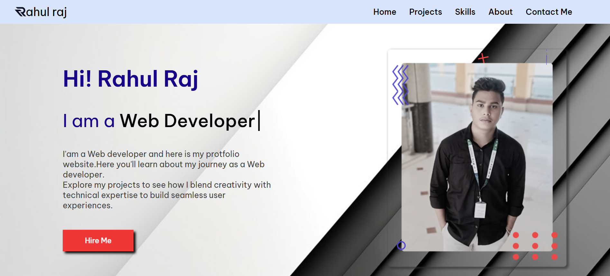

# Rahulraj-portfolio

## 🚀 Welcome to Rahul Raj Sharma's Portfolio 🌟

As a skilled full stack and software developer, I bring innovation and efficiency to every project I undertake. This portfolio website serves as a testament to my expertise and showcases a selection of my finest work.

Explore through a curated collection of projects ranging from dynamic web applications to robust software solutions. Each project demonstrates my commitment to quality craftsmanship, attention to detail, and a passion for problem-solving.

With a strong foundation in both front-end and back-end technologies, I specialize in creating seamless user experiences while ensuring optimal functionality and performance under the hood. Whether it's crafting elegant user interfaces with HTML, CSS, and JavaScript or architecting powerful backend systems with languages like Python, Node.js, or Java, I thrive on turning ideas into reality.

But it's not just about the code. I believe in collaboration, communication, and continuous improvement. I approach every project with an open mind, ready to learn and adapt to new challenges and technologies. My dedication to staying updated with the latest industry trends and best practices ensures that my solutions are always cutting-edge and future-proof.

So whether you're a fellow developer seeking inspiration, a potential client in need of a custom software solution, or a recruiter looking for top talent, I invite you to explore my portfolio and discover how I can help bring your ideas to life.

Thank you for visiting, and I look forward to connecting with you! 🌱🖥️🎨
